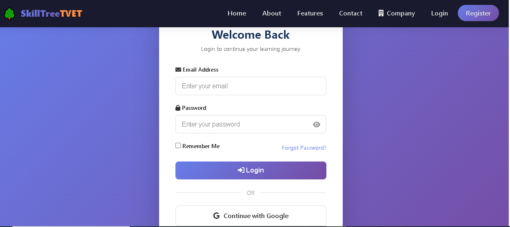
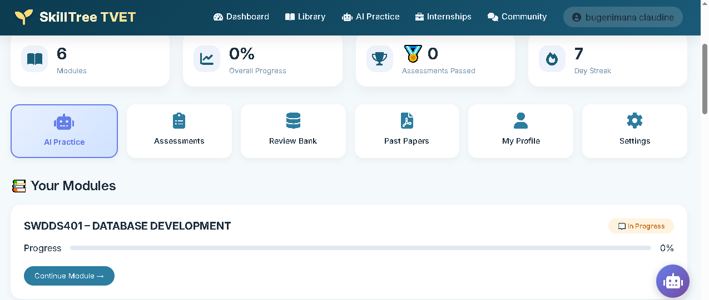
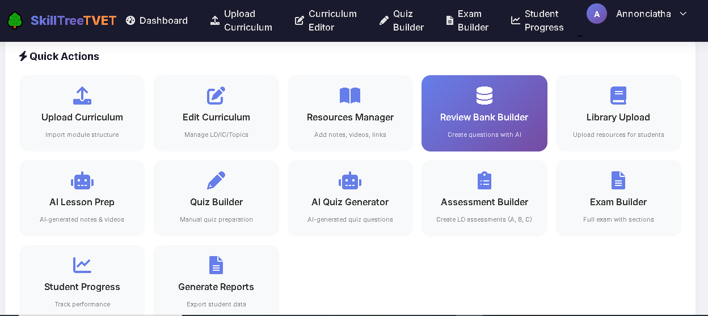

# AI Learning Platform (SkillTree TVET System)

A web-based Learning Management System (LMS) designed to support students, teachers, and administrators in delivering and managing vocational and technical education. The platform integrates AI-powered learning tools, assessments, and interactive modules to enhance digital learning experiences.

---

## 📸 Screenshots

### Login Page

### Student Dashboard

### Teacher Dashboard

---

## Features

- Student registration & secure login system  
- Role-based dashboards (Admin, Student, Teacher)  
- Database-driven learning content management  
- Interactive learning modules  
- AI Tutor Assistant (mentor, coach & learning support system)  
- AI-generated quizzes, assessments & exams  
- Self-testing and practice system for learners  
- Lesson and assessment preparation tools for trainers  
- Student progress tracking & performance analytics  
- Internship & industry attachment support system  
- Communication forum for learners and instructors  
- Digital support for vocational and technical education delivery  

---

## 🛠️ Tech Stack

- PHP  
- MySQL  
- JavaScript  
- HTML & CSS  
- AJAX  

---

## 📊 Status

Currently under development and testing. Continuous improvements are being made to enhance AI features, user experience, and system performance.

---

## 👨‍💻 Author

**MUKARUGWIZA Annonciatha**  
ICT Trainer & IT Technician  
Aspiring Data Engineer  
